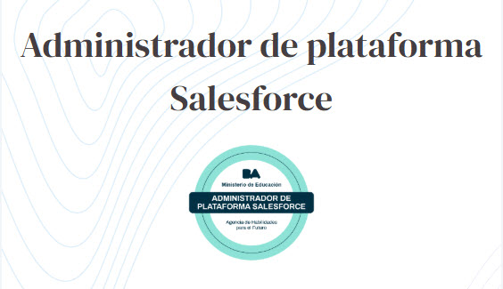

# Hi there, I'm Javier Sigot 👋

*Software Engineer | Support Engineer Specialist | DevOps | Problem Solver*

---

## About Me

I'm a passionate technical support engineer with over 25 of experience in troubleshooting, customer success, and product support. I enjoy solving complex problems and bridging the gap between technical teams and end users.

I’m currently focused on improving user experience, automating processes, and learning new technologies to deliver impactful solutions.

---

## Skills & Technologies

- Technical Support & Troubleshooting  
- Customer Service Excellence
- Salesforce administrator  
- Bug Tracking & Issue Resolution (Jira, Confluence, SMAX, Bitbucket)  
- Programming: HTML, CSS, JS, PHP, Python
- Databases: Oracle, SQLite, MySQL
- C- Scripting: Bash, PowerShell, MS-DOS
- Middleware: Apache Tomcat, Kafka, RabbitMQ
- APIs & Tools: Postman, SoapUI
- Monitoring: Kibana, Grafana, Nagios
- Development: Visual Studio Code
- Tools: Wireshark, Toad, SecureCRT, Putty 
- Communication & Documentation  

---

## Contact Me

- 📫 Email: javier.sigot@gmail.com  
- 🌐 Website / Portfolio: https://github.com/Jsaigor/  
- 🔗 LinkedIn: https://www.linkedin.com/in/javier-sigot-990342165/
- 📞 WhatsApp: https://wa.me/549113440923

---

Thanks for stopping by! Feel free to connect or check out my repositories.

